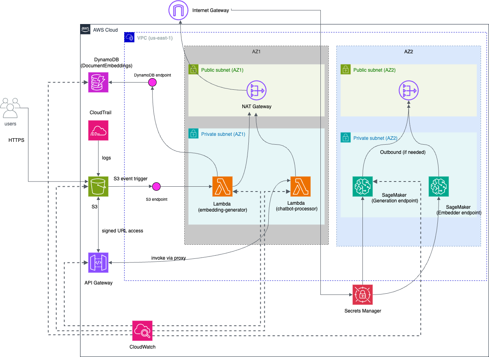

# RAG-TACS: Retrieval-Augmented Generation for Technical AWS Cloud Support - A chatbot

**RAG-TACS** is a cloud-based platform developed for the **Advanced Cloud Architecting** Midterm project at Dalhousie University. The system delivers an AI-powered Technical Support Chatbot using Retrieval-Augmented Generation (RAG), integrating Sentence-Transformers for embedding generation and DistilGPT-2 for context-aware responses to assist with AWS-related technical queries. The primary goal is to provide a secure, scalable, and cost-effective solution for automated support, designed for technical users needing quick resolutions (e.g., S3 access issues, DynamoDB troubleshooting) and capable of handling moderate traffic with an average response time of 4.8 seconds.

---

## Features

- 🔐 **Secure Configuration**: User access secured via private VPC subnets and AWS Secrets Manager
- 📤 **Query Processing**: Efficient query handling through AWS API Gateway and Lambda
- ⏳ **Dynamic Embedding Generation**: Automatic embedding updates with S3 event-triggered Lambda
- 💾 **Context Storage**: Fast retrieval of embeddings and documents using Amazon DynamoDB and S3
- 📊 **Monitoring and Auditing**: Real-time tracking with Amazon CloudWatch and API auditing with CloudTrail
- 🌐 **Static Frontend**: Simple web interface hosted on Amazon S3

---

## Architecture Diagram

Below is the architecture diagram illustrating the system’s components and their interactions:

---

## Tech Stack

- **Frontend**: Static HTML (hosted on S3)
- **Backend**: Python (AWS Lambda)
- **Compute**: AWS Lambda, Amazon SageMaker
- **Storage**: Amazon S3, Amazon DynamoDB
- **Security**: AWS Secrets Manager, AWS KMS
- **Networking**: Amazon VPC, NAT Gateway, Amazon API Gateway
- **Monitoring**: Amazon CloudWatch, AWS CloudTrail
- **Image Processing**: OpenCV (Python)
- **Deployment**: AWS CLI

---
